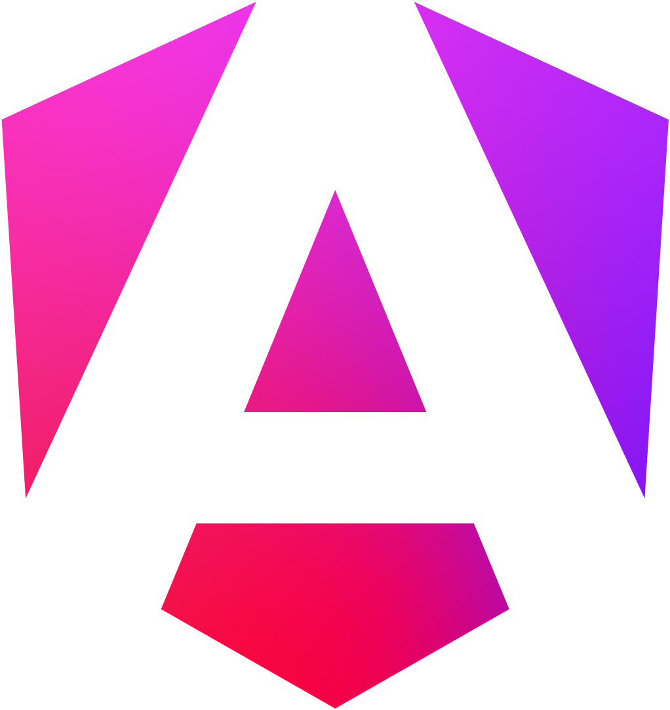
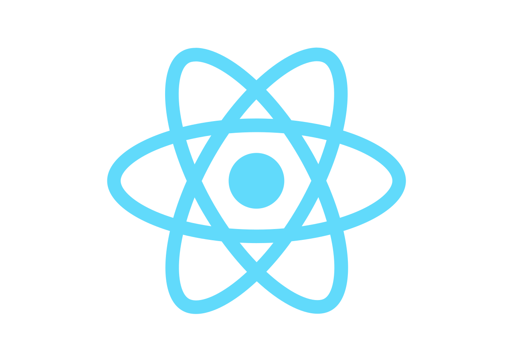
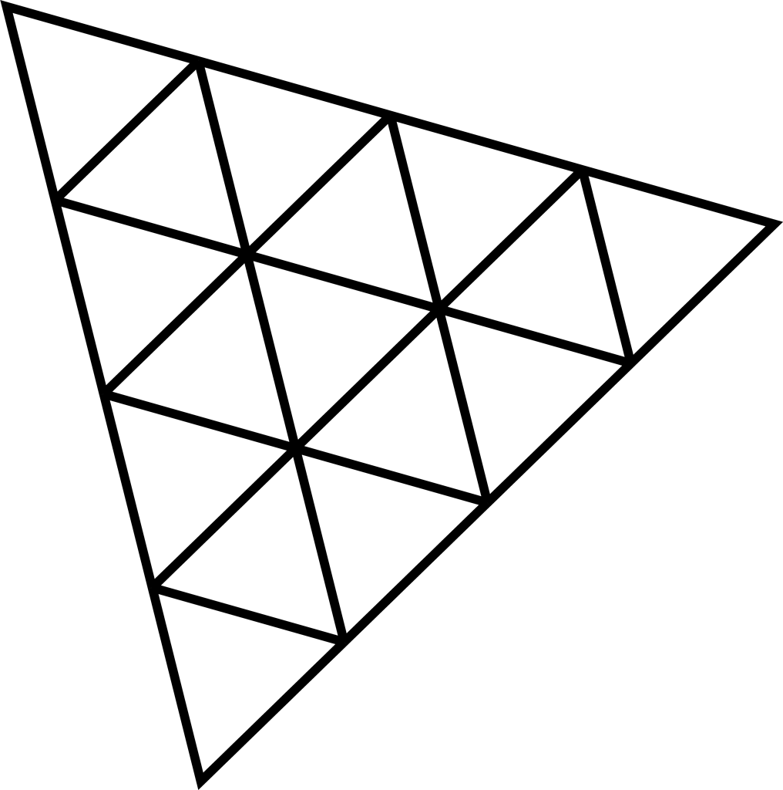
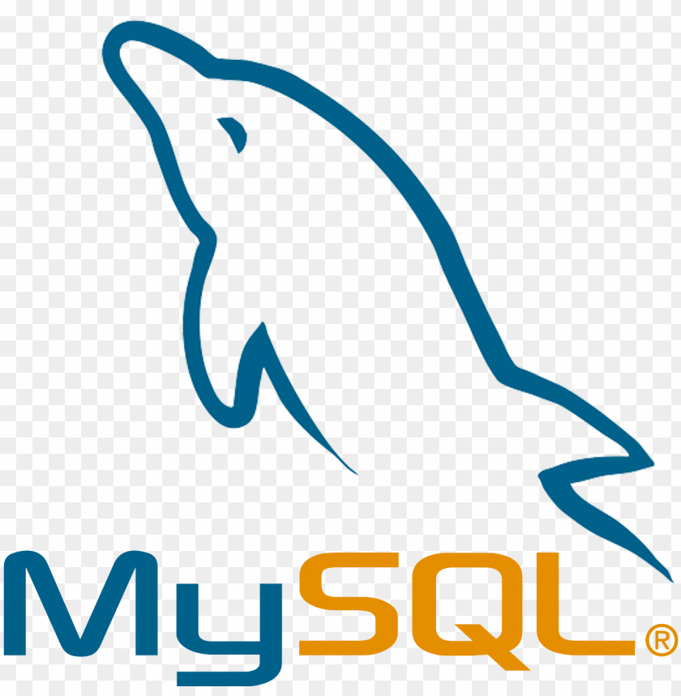
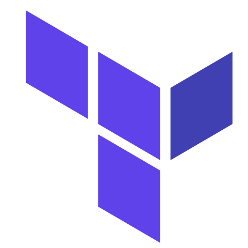

# Developer and Architect of Virtual Worlds & Logical Systems

I build where logic meets imagination. My work is a constant exploration of software architecture as a craft—creating ludic experiences, complex engines, and intelligent systems that feel alive. Since 2019, I've been loving abstractions and business logic as a WEB developer.

---

### 🏛️ The Craft of Architecture
- **Creative Engineering:** Designing systems that aren't just efficient, but elegant and expressive.
- **Ludic Systems:** Building custom game engines and interactive environments from the ground up.
- **Cognitive Agents:** Researching Multi-Agent Systems (MAS) and BDI logic to bridge simulation and autonomy at CHON group!

---

### 🛠️ The Architect's Toolbox

#### **Languages & Core**

  
  
  
  

#### **Frontend & Immersive Arts**

  
  
  
  
  
  

#### **Backend & Intelligence**

  
  
  
  
  
  

#### **Infrastructure & DevOps**

  
  
  

---

### 🚀 Featured Projects

#### 🎭 [A Marionete (Game Engine)](https://github.com/kkphoenixgx)
A Roguelite Bullet-Hell built with a **custom 100% TypeScript engine**. Features Zero-Garbage Collection architecture and Generative AI (Ollama/LLM) for NPC decision-making.

#### 🌐 [Personal Portfolio V2](https://github.com/kkphoenixgx)
High-performance interactive experience merging **Angular 19** with **Three.js** and **Matter.js**. Demonstrates advanced memory management and rendering optimization.

#### 🛰️ [The Big Agent](https://github.com/kkphoenixgx)
Embedded Multi-Agent System inspired by "1984", utilizing **BDI logic (AgentSpeak)** for drone autonomous security operations. Built with Java and integrated with Webots/Three.js for physical simulation.

---

### 📊 Stats & Presence

  
  

 

  

  

---

*"It is not about the framework, it's about the solution and scalability with architecture."*
