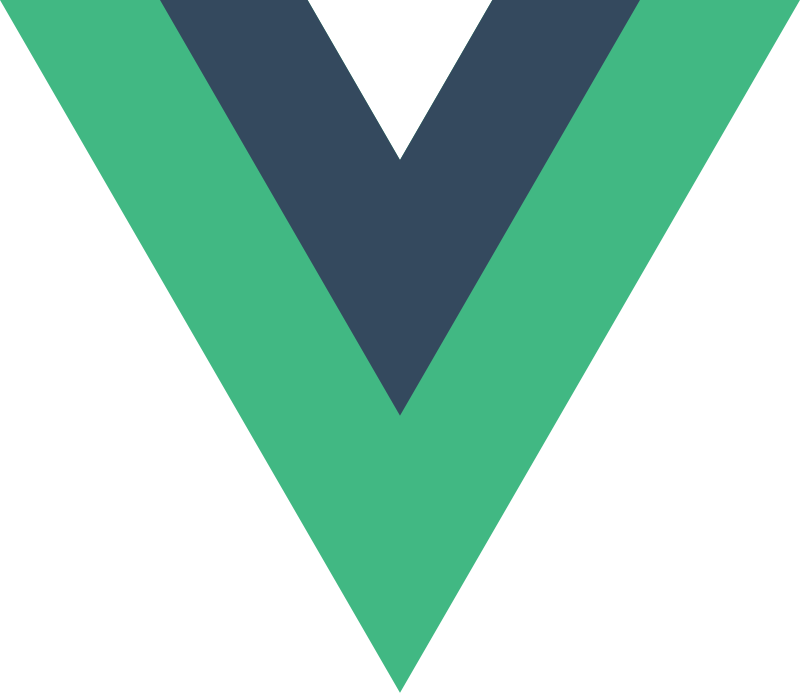

# Wellcome to my GitHub page! please enjoy

## Who am I?

- 😁 I am a Brazilian programming student, I really love programming and I really would like to apply my knolage, be part of and improve our business
- 🌱 I am currently learning everything :V, But specially javascript, I wanna master it. React, Next, Node, Typescript, Electron, Angular, Sass.
- 👾 I am actually side leaning other languages for fun, like java, C# and with my web develop course, I already have good skill level in HTML5, CSS3, and of course JavaScript.
- 👯 I am helping my friends to start in programming too and working in side projects.
- ⚡ Fun fact: Well, I actually love chess, astronomy and I love software architecture, my hobbie is learn it. I already read Clean Code, Clean Arquiteture and I am learning design patterns from Design Patterns: Elements of Reusable Object-Oriented Software.

 

  <h2 style="text-align: center"><b>Languages and tolls</b></h2>

  
  
  
  
  

  
  
  
  
  

  
  

  
  
  
  

  

  
  
  
  
  
  
  
  
  
  
  
  
  
  
    

 

<h2 align="center"><b>GitHub Stats</b></h2>

